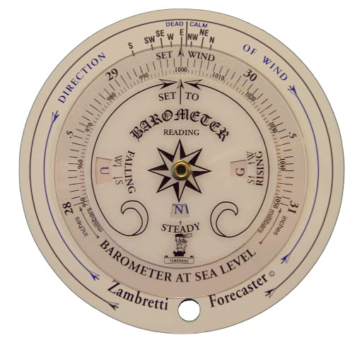
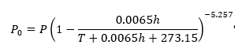
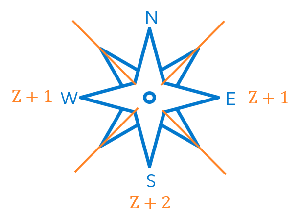
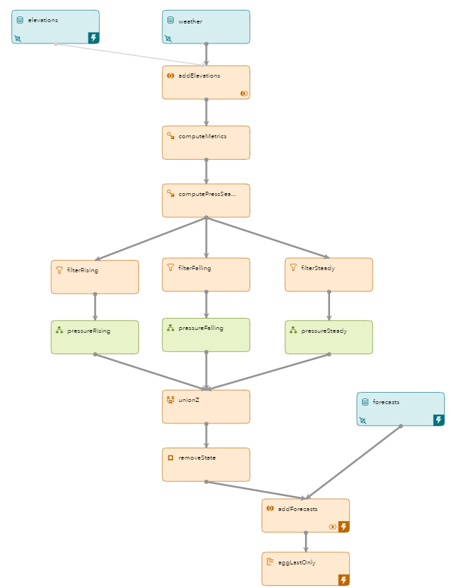

# Zambretti Algorithm for Weather Forecasting

## Overview

Welcome to the Zambretti Algorithm for Weather Forecasting ESP example. In the ESP model you will learn about various types of ESP windows and their functions including:

* How to use the [ESP Expression Language](https://go.documentation.sas.com/?cdcId=espcdc&cdcVersion=6.2&docsetId=espcreatewindows&docsetTarget=n19ijp61ldn7vrn10czlree4uqir.htm&locale=en) to perform calculations
* How to filter outliers using [Filter](https://go.documentation.sas.com/?cdcId=espcdc&cdcVersion=6.2&docsetId=espcreatewindows&docsetTarget=p1laytbc862ix9n1w5rm9reywors.htm&locale=en) windows
* How to detect trends using [Pattern](https://go.documentation.sas.com/?cdcId=espcdc&cdcVersion=6.2&docsetId=espcreatewindows&docsetTarget=n1rj6nmwuzuxisn12tjeu0o336tt.htm&locale=en) windows
* How to rejoin a split stream using a [Union](https://go.documentation.sas.com/?cdcId=espcdc&cdcVersion=6.2&docsetId=espcreatewindows&docsetTarget=n0nqt12sgro7rnn1jfg4ql0qsafw.htm&locale=en) window
* How to use a [Remove State](https://go.documentation.sas.com/?cdcId=espcdc&cdcVersion=6.2&docsetId=espcreatewindows&docsetTarget=p0usk3uf3bcnebn1m99g1jbvvhxu.htm&locale=en) window to convert Upsert events into Insert events

 

### Zambretti Algorithm

#### Zambretti Algorithm Overview

The Zambretti algorithm is based on an instrument developed by Negretti and Zambra in the mid 1800s to forecast local weather. The output of the instrument or algorithm is one of 26 forecast statements, such as becoming unsettled. The forecast can be as much as 94% accurate in the Northern Hemisphere.

The forecast is determined based on four parameters: 

* Value of the pressure at sea level
* Whether the pressure is falling, rising, or steady
* Pressure meets range requirements
* Wind direction

#### Pressure at Sea Level

Barometric pressure is affected by altitude and temperature. Therefore, all pressure values reported must be converted to the pressure at sea level using the following formula. This provides a common metric for all locations.

Here is the equivalent of the formula using the ESP expression language.

~~~
pressure * pow(1 - (0.0065 * elevationM) / (tempC + (0.0065 * elevationM) + 273.15),-5.257 ))
~~~

#### Pressure Trends

The most significant factor in our forecast is whether the pressure is falling, rising, or steady. This is determined by a change or lack thereof of 1.6 millibars in a three-hour period. The pressure values must also fall in specified ranges, meaning some values are thrown out.

The following table shows the requirements for each type of pressure trend:

|  | Pressure at Sea Level Range | Trend Requirement |
| ------ | ------ | ------ |
| Falling | Between 985 mbar and 1050 mbar | Drop of 1.6 mbar in 3 hours |
| Steady | Between 960 mbar and 1033 mbar | No drop or rise of 1.6 mbar in 3 hours |
| Rising | Between 947 mbar and 1030 mbar | Rise of 1.6 mbar in 3 hours |

#### Algorithms

To determine the forecast value (Z), we use the appropriate calculation and lookup table based on the trend. A seperate calculation and lookup table exists for falling, rising, and steady pressure trends.

This is the calculation and lookup table for a falling pressure.

~~~math
Zf=127-0.12P_0
~~~

| Zf | Forecast |
| ------ | ------ |
| 1 | Settled Fine |
| 2 | Fine Weather |
| 3 | Fine, Becoming Less Settled |
| 4 | Fairly Fine, Showery Later |
| 5 | Showery, Becoming More Unsettled |
| 6 | Unsettled, Rain Later |
| 7 | Rain at Times, Worse Later |
| 8 | Rain at Times, Becoming Very Unsettled |
| 9 | Very Unsettled, Rain |

The calculation and lookup table are different if we determine the pressure is steady.

~~~math
Zs=144-0.13P_0
~~~

| Zs | Forecast |
| ------ | ------ |
| 10 | Settled Fine |
| 11 | Fine Weather |
| 12 | Fine, Possibly Showers |
| 13 | Fairly Fine, Showers Likely |
| 14 | Showery, Bright Intervals |
| 15 | Changeable, Some Rain |
| 16 | Unsettled, Rain at Times |
| 17 | Rain at Frequent Intervals |
| 18 | Very Unsettled, Rain |
| 19 | Stormy, Much Rain |

If the pressure is rising, we use this calculation and lookup table.

~~~math
Zr=185-0.16P_0
~~~

| Zr | Forecast |
| ------ | ------ |
| 20 | Settled Fine |
| 21 | Fine Weather |
| 22 | Becoming Fine |
| 23 | Fairly Fine, Improving |
| 24 | Fairly Fine, Possibly Showers Early |
| 25 | Showery Early, Improving |
| 26 | Changeable, Mending |
| 27 | Rather Unsettled, Clearing Later |
| 28 | Unsettled, Probably Improving |
| 29 | Unsettled, Short Fine Intervals |
| 30 | Very Unsettled, Finer at Times |
| 31 | Stormy, Possibly Improving |
| 32 | Stormy, Much Rain |

#### Wind Direction

The direction of the wind and the season have a minor affect on the forecast. If the wind is from the south, we add 2 to the Z factor. If from the west or east, we add 1. A wind from the north has no effect.

### ESP Model

Here is the model in ESP Studio. 

#### Source Windows

There are three source windows, **weather**, **elevations**, and **forecasts**. The **weather** source window publishes the live weather data once an hour using a URL connector. For more information go to the [Streaming Live Weather Data GitHub](https://gitlab.sas.com/IOT/tutorials/ESP-tutorials/streaming-live-weather-data) page. The **elevations** source window provides the elevations of each city needed to calculate the pressure at sea level. Near the end of the model is the **forecasts** source window which assigns the appropriate text to each Z value.

#### Join Window

The **addElevations** join window joins the weather stream with the elevations table using a simple left-outer join.

#### Compute Windows

Next, there are two compute windows, **computeMetrics** and **computePressSeaLevel**. The **computeMetrics** window converts `temp` to `tempC` and `elevation` to `elevationM` using simple expressions. It also calculates `zWind` based on the wind direction. The **computePressSeaLevel** window calculates the pressure at sea level.

Here are the ESP expressions for pressure at sea level and Z wind:

##### pressureSeaLevel

~~~
pressure * pow(1 - (0.0065 * elevationM) / (tempC + (0.0065 * elevationM) + 273.15),-5.257 ))
~~~

##### zWind

~~~
if (windDir >= 135) and (windDir <= 225) then return 2 else if (windDir >= 315) or (windDir <=45) then return 0 else return 1
~~~

#### Filter Windows

Now we split the stream three times to evaluate whether the pressure is falling, rising, or steady. Prior to the pattern detection, there is a filter window for each segment to allow only the pressure values within range to pass through. Here is the filter expression for the **filterRising** window.

~~~
pressureSeaLevel >= 945 and pressureSeaLevel <= 1030
~~~

#### Pattern Windows

There is a pattern window for **pressureRising**, **pressureFalling**, and **pressureSteady**. All three pattern windows use `name` as the index and `datetime` as the time field. 

##### pressureFalling

The first event of interest (EOI), `e1`, simply stores the value of pressure at sea level. `e1` is the same for all three pattern windows.

~~~
p0==pressureSeaLevel
~~~

The second EOI, `e2` of the **pressureFalling** window looks for a drop of 1.6 millibars.

~~~
p0>pressureSeaLevel + 1.6
~~~

The pattern logic says if the first EOI (`e1`) is followed by the second (`e2`) within 10800 seconds, output a record:

~~~
fby{10800 seconds}(e1,e2)
~~~

##### pressureRising

The **pressureRising** pattern window is the same as **pressureFalling** window except for EOI `e2`. `e2` detects a rise in pressure of at least 1.6 millibars. 

~~~
p0<pressureSeaLevel-1.6 
~~~

##### pressureSteady

The **pressureSteady** window uses three EOIs. The first EOI is the same as in the other pattern windows. EOI `e2` detects events where there was no fall or rise in pressure of at least 1.6 millibars. It also stores the pressure value for this event for use in EOI `e3`.

~~~
p0<pressureSeaLevel + 1.6 and p0>pressureSeaLevel - 1.6 and p1==pressureSeaLevel
~~~

The third EOI, `e3`, looks for events where there was no rise or fall of 1.6 millibars for both EOIs `e1` and `e2`.

~~~
p0<pressureSeaLevel + 1.6 and p0>pressureSeaLevel - 1.6 and p1<pressureSeaLevel + 1.6 and p1>pressureSeaLevel - 1.6
~~~

The pattern logic for **pressureSteady** outputs a record if all three EOIs take place within 10,800 seconds.

~~~
fby{10800 seconds}(e1,e2,e3)
~~~

The output schemas of each pattern window include the `name`, `datetime`, and the appropriate expression to calculate `Z`. Here is the expression to calculate Z for a falling barometer:

~~~
floor(127 - 0.12 * pressureSeaLevel) + Zwind
~~~

#### Union Window

We need to rejoin the streams and we do so using a union window using normal key merging.

#### Remove State Window

The **removeState** window converts the Upsert events streaming from the **unionZ** window into Insert events to facilitate the upcoming join.

#### Join Window

The **addForecasts** join window joins the event stream from the removeState window with the forecasts table using a simple inner join using `Z` as the join field.

#### Aggregate Window

The **aggLastOnly** aggregate window uses the `ESP_aLast` function to output only the most recent event for each value of key field `name`.

### Prerequisites

[SAS Event Stream Processing 6.2](https://www.sas.com/en_us/software/event-stream-processing.html)

APPID from [OpenWeather](https://openweathermap.org/api)

### Running

There are two models you can execute. `zambretticsv.xml` uses a csv file as input and executes quickly. `zambrettiLive.xml` uses a URL connector to stream live weather data once an hour. 

Use the following instructions to execute the Zambretti Algorithm project:

#### Download Files from GitLab

All files required to execute the Zambretti Algorithm model are available in the [files](files) directory of this page. Download the following eight files:

* [conditions.csv](files/conditions.csv) – Forecast values
* [config.xml](files/config.xml) – Configuration file for URL connector
* [elevations.csv](files/elevations.csv) – Elevation values
* [run_zambretticsv.sh](files/run_zambretticsv.sh) – Startup script to execute model using csv file
* [run_zambrettiLive.sh](files/run_zambrettiLive.sh) – Startup script to execute model using URL connector
* [zambretti_in.csv](files/zambretti_in.csv) – Input data file
* [zambretticsv.xml](files/zambretticsv.xml) – Model using csv file as input
* [zambrettiLive.xml](files/zambrettiLive.xml) – Model using URL connector

#### Create Server Directory

Create a server directory for the project’s files. The following is an example of the command to create a directory:

~~~bash
mkdir /home/zestem/zambretti
~~~

#### Edit Startup Script

You must edit the startup script, `run_zambretticsv.sh` or `run_zambrettiLive.sh` to specify the correct server directories.

1.	Open `run_zambretticsv.sh` or `run_zambrettiLive.sh` with a text editor.

    ~~~bash
    # Register (DateFlux) ESP environment
    export DFESP_HOME=/opt/sas/viya/home/SASEventStreamProcessingEngine/6.2

    export PATH=$DFESP_HOME/bin:$PATH
    export LD_LIBRARY_PATH=$DFESP_HOME/lib:$DFESP_HOME/lib/tk:/opt/sas/viya/home/SASFoundation/sasexe:$DFESP_HOME/ssl/lib

    export PROJDIR=/home/zestem/zambretti

    dfesp_xml_server -http 61002 -pubsub 61003 -model file:///home/zestem/zambretti/zambretticsv.xml -C "server.single_port_mode=true"
    ~~~

2.	Go to the `export PROJDIR=` line and edit the value to be the directory you created. The following is an example.

    ~~~bash
    export PROJDIR=/home/zestem/Zambretti
    ~~~

3.	Go to the last line (command to start XML Server) and edit the `-model` parameter to include the full path to the input csv file. Ensure there are the correct number of forward slashes (/) at the beginning of the filename. The following is an example:
	
    ~~~bash
    -model file:///home/zestem/zambretti/zambretticsv.xml
    ~~~

#### Upload Files

Upload all the files to the directory you created. Change the permission of the appropriate startup script so it is executable. The following is an example of the command to do this:

~~~bash
chmod 777 /home/zestem/zambretti/run_zambretticsv.sh
~~~

#### Execute Model

1.	Change directories to the directory containing the files you uploaded. The following is an example:
	
    ~~~bash
    cd /home/zestem/zambretti
    ~~~

2.	Type the following to execute the startup script and start the model:

    ~~~bash
    ./run_zambretticsv.sh
    ~~~

    The terminal should display information about the model executing on the ESP XML Server.

## Contributing

> We welcome your contributions! Please read [CONTRIBUTING.md](CONTRIBUTING.md) for details on how to submit contributions to this project. 

## License

> This project is licensed under the [Apache 2.0 License](LICENSE).

## Additional Resources

* [SAS Event Stream Processing 6.2 Documentation](https://go.documentation.sas.com/?cdcId=espcdc&cdcVersion=6.2&docsetId=espov&docsetTarget=home.htm&locale=en)
* [Wikipedia Article](https://en.wikipedia.org/wiki/Zambretti_Forecaster)

